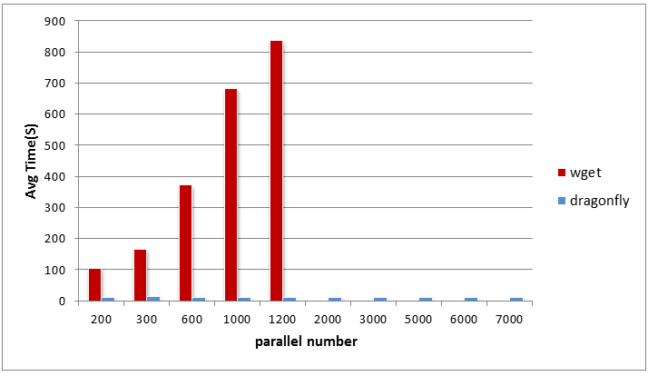
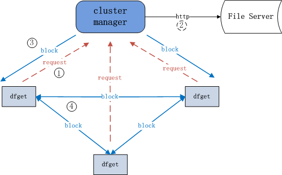

Dragonfly 是一款基于 P2P 的智能镜像和文件分发工具。它旨在提高文件传输的效率和速率，最大限度地利用网络带宽，尤其是在分发大量数据时，
例如应用分发、缓存分发、日志分发和镜像分发。

在阿里巴巴，Dragonfly 每个月会被调用 20 亿次，分发的数据量高达 3.4PB。Dragonfly 已成为阿里巴巴基础设施中的重要一环。

尽管容器技术大部分时候简化了运维工作，但是它也带来了一些挑战：例如镜像分发的效率问题，尤其是必须在多个主机上复制镜像分发时。

Dragonfly 在这种场景下能够完美支持 Docker 和 [PouchContainer](https://github.com/alibaba/pouch)。它也兼容其他格式的容器。
相比原生方式，它能将容器分发速度提高 57 倍，并让 Registry 网络出口流量降低 99.5%。

Dragonfly 能让所有类型的文件、镜像或数据分发变得简单而经济。

## Dragonfly 有何优势？

本项目是阿里巴巴所使用的 Dragonfly 的开源版本。它具备以下特性：

**注意：**更多面向阿里巴巴内部的功能也将逐步开源。敬请期待！

- **基于 P2P 的文件分发**：通过利用 P2P 技术进行文件传输，它能最大限度地利用每个对等节点（Peer）的带宽资源，以提高下载效率，并节省大量跨机房
  带宽，尤其是昂贵的跨境带宽。
- **非侵入式支持所有类型的容器技术**：Dragonfly 可无缝支持多种容器用于分发镜像。
- **机器级别的限速**：除了像许多其他下载工具（例如 wget 和 curl）那样的针对当前下载任务的限速之外，Dragonfly 还支持针对整个机器的限速。
- **被动式 CDN**：这种 CDN 机制可防止重复远程下载。
- **高度一致性**：Dragonfly 可确保所有下载的文件是一致的，即使用户不提供任何检查代码（MD5）。
- **磁盘保护和高效 IO**：预检磁盘空间、延迟同步、以最佳顺序写文件分块、隔离网络-读/磁盘-写等等。
- **高性能**：SuperNode 是完全闭环的，意味着它不依赖任何数据库或分布式缓存，能够以极高性能处理请求。
- **自动隔离异常**：Dragonfly 会自动隔离异常节点（对等节点或 SuperNode）来提高下载稳定性。
- **对文件源无压力**：一般只有少数几个 SuperNode 会从源下载文件。
- **支持标准 HTTP 头文件**：支持通过 HTTP 头文件提交鉴权信息。
- **有效的 Registry 鉴权并发控制**：减少对 Registry 鉴权服务的压力。
- **简单易用**：仅需极少的配置。

## 它与传统解决方案相比怎么样？

我们开展了一个实验来对比 Dragonfly 和 wget 的性能。

| 测试环境         |                                 |
| ---------------- | ------------------------------- |
| Dragonfly 服务端 | 2 \* (24 核 64GB 内存 2000Mb/s) |
| 文件源服务端     | 2 \* (24 核 64GB 内存 2000Mb/s) |
| 客户端           | 4 核 8GB 内存 200Mb/s           |
| 目标文件大小     | 200MB                           |
| 实验日期         | 2016 年 4 月 20 日              |

实验结果如下图所示。

如统计图所示，对于 Dragonfly，不论有多少个客户端同时下载，平均下载时间始终约为 12 秒。但是对于 wget，下载速度会随着客户端数量的增加不断增加。
当 wget 客户端数量达到 1,200 个时，文件源崩溃了，因此无法继续为任何客户端提供服务。

## 它的工作原理是什么？

Dragonfly 下载普通文件和下载容器镜像的工作原理略有不同。

### 下载普通文件

SuperNode 充当 CDN，并负责调度对等节点（Peer）之间的文件分块传输。dfget 是 P2P 客户端，也称为“Peer”（对等节点），主要用于下载和共享文件分
块。

### 下载镜像文件

Registry 类似于文件服务器。dfget proxy 也称为 dfdaemon，会拦截来自 docker pull 或 docker push 的 HTTP 请求，然后使用 dfget 来处理那
些跟镜像分层相关的请求。

### 下载文件分块

每个文件会被分成多个分块，并在对等节点之间传输。一个对等节点就是一个 P2P 客户端。SuperNode 会判断本地是否存在对应的文件。如果不存在，则会将其从
文件服务器下载到 SuperNode。

